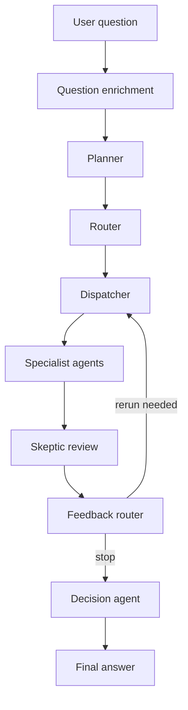

# Multi-Agent Decision System

This project is a LangGraph-based workflow that takes one user question, breaks it into smaller parts, runs the right specialist agents, checks the result, and then produces a final recommendation.

## How it works

1. The user enters a question.
2. The system asks a few follow-up questions if the request is underspecified.
3. A planner turns the problem into smaller sub-questions.
4. A router assigns each sub-question to the best specialist.
5. A dispatcher decides which agents should run.
6. The specialist agents handle cost, engineering, performance, and security analysis.
7. A skeptic reviews the specialist outputs and flags gaps.
8. A feedback step decides whether any specialists should rerun.
9. A decision agent combines everything into the final answer.

## Flowchart



## Main files

- `graphs/main.py`: current entry point for the graph flow
- `graphs/graph.py`: LangGraph wiring
- `graphs/nodes.py`: node logic and run logging
- `graphs/run_store.py`: SQLite run and event storage
- `top_level_agents/`: planner, router, dispatcher, skeptic, and decision logic
- `sub_agents/`: specialist analysis agents and prompts

## Storage

The app stores run history in `graphs/runs.sqlite3` so each question and rerun can be traced later.

## Run it

1. Set `DEEPSEEK_API_KEY` in `.env`.
2. Install the project dependencies.
3. Run:

```bash
python graphs/main.py
```

## Notes

- Keep `.env` out of version control.
- The generated SQLite file and graph image are runtime artifacts, not source files.
